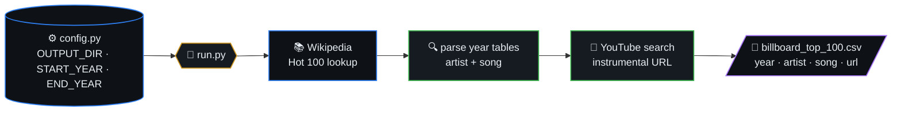
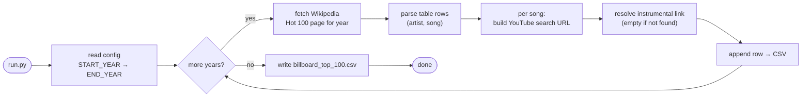
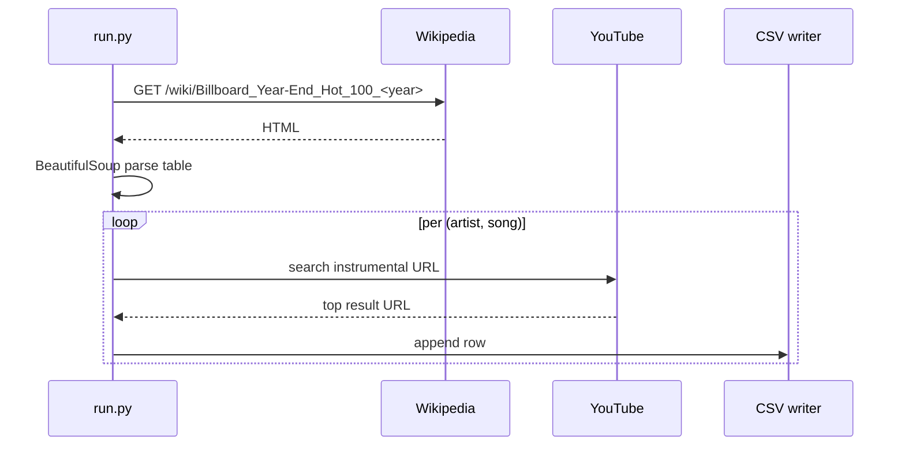

# **Time Machine Track (TMTrack) Dataset Generator**

> Dataset generator for The Hot 100 Billboard standard. Uses Wikipedia
> as the source for tracks per year (1946–2020), then resolves the
> YouTube URL of the instrumental version per song.



## Table of contents

- [Generated Metadata](#generated-metadata)
- [Generation pipeline (algorithm)](#generation-pipeline-algorithm)
- [Per-year scrape sequence](#per-year-scrape-sequence)
- [Dataset Schema](#dataset-schema)
- [Use Cases](#use-cases)
- [Config](#config)
- [Setup & Running](#setup--running)

## Generation pipeline (algorithm)



## Per-year scrape sequence



## **Generated Metadata**
The generator makes use of Wikipedia to get the Hot 100 songs from 1946-2020. Once the song and artist is known, a Youtube link of the instrumental version of the song is fetched and is appended to each record. The csv will be dumped as `billboard_top_100.csv` to the directory that is specified in [config](#config).

## Dataset Schema
The output dataset consists of 4 columns labled: [year, artist, song, youtube_search_url].

- **year(numerical)=** year the song made it to Hot 100.
- **artist(string)=** artist of the song that made it to Hot 100.
- **song(string)=** title of the song that made it to Hot 100.
- **youtube_search_url(string)=** youtube url of the instrumental song. If url is not found, the default value of the field will be ""(empty string).

### **Sample**
```
year,artist,song,youtube_search_url
2000,Faith Hill,Breathe,https://www.youtube.com/watch?v=DDfcnBpQDNY
2000,"Santana, Rob Thomas",Smooth,https://www.youtube.com/watch?v=TDjDIhiIXQs
2000,"Santana, The Product G&B",Maria Maria,https://www.youtube.com/watch?v=DFDAWasYOfo
```

## **Use Cases**
The uses case for the dataset is for performing data science based on DSP analysis of songs. Post processing of the out CSV

## **Config**
Inside of `config.py` the following config options are available for the user to change when generating the dataset:
- **OUTPUT_DIR=** directory to which to save the output dataset csv.
- **START_YEAR=** the start year for which to get The Hot 100. Support range is between [1946,2020].
- **END_YEAR=** the end year for which to get The Hot 100. Support range is between [1946,2020].

## **Setup & Running**
To run and generate the dataset, the following steps must be followed:

1. Install Python 3.7+.
2. Get dependencies with `pip3 install -r requirements.txt`
3. Setup config as [described](#config).
4. Run the script with `python3 run.py`. *Note that this step could take few hours*.